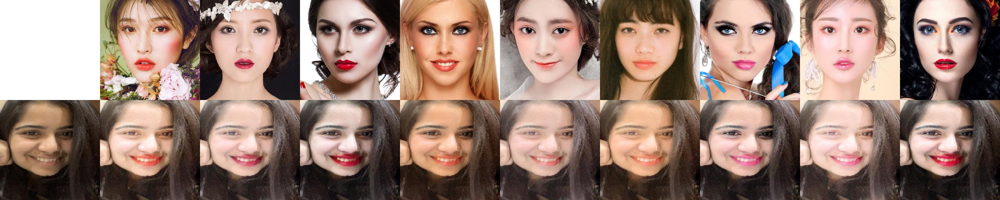

# BeautyGAN

###  Introduction

BeautyGAN: Instance-level Facial Makeup Transfer with Deep Generative Adversarial Network

Official Website：[http://liusi-group.com/projects/BeautyGAN](http://liusi-group.com/projects/BeautyGAN)


Papers and data sets are provided, but there is no open source code, and no trained models are provided

Recurring effect



### Instructions

- Python3.6
- TensorFlow1.9

Download the trained model

- [https://pan.baidu.com/s/1wngvgT0qzcKJ5LfLMO7m8A](https://pan.baidu.com/s/1wngvgT0qzcKJ5LfLMO7m8A)，7lip
- [https://drive.google.com/drive/folders/1pgVqnF2-rnOxcUQ3SO4JwHUFTdiSe5t9](https://drive.google.com/drive/folders/1pgVqnF2-rnOxcUQ3SO4JwHUFTdiSe5t9)


new folder`model`，Put the model file in it

`imgs`Includes 11 pictures without makeup and 9 pictures with makeup

Default pair`imgs/no_makeup/xfsy_0068.png`Apply makeup

```
python main.py
```

If you need to apply makeup to other face pictures, just pass in the picture path. It is recommended to use a face picture of a suitable size

```
python main.py --no_makeup xxx.xxx
```
